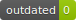

   

# setup-gh-badges (Windows only... yet)

> [gh-badges](https://www.npmjs.com/package/gh-badges) made simple 

## 🛠️ Add it to `devDependencies`

- `yarn add -D setup-gh-badges`

Will append the following to your current npm scripts under `package.json`:
```
    "scripts": {
        // ...your scripts,
        "badges:win": "node_modules/setup-gh-badges/generate_badges_win.sh"
    },
```

> _NOTE:_ Feel free to send a PR for a Mac Bash version or even better a cross-platform JS one :-)

## 📌 Recommended if you don't have a CI server

- `yarn add -D husky`

- Then add the following hook to your `package.json`:
```
    "husky": {
        "hooks": {
            "pre-push": "yarn badges:win"
        }
    },
```
