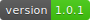
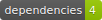
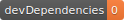
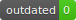

   

# setup-gh-badges
gh-badges made simple

## Usage

- `yarn add -D setup-gh-badges`

Will append the following to your current npm scripts under `package.json`:

```
"scripts": {
    // ...your scripts,
    "badges:win": "./scripts/generate_badges_win.sh"
},
```

> NOTE: Feel free to send a PR for a Mac Bash version or even better a cross-platform JS one :-)

## Recommended if you don't have a CI server

- `yarn add -D husky`

- Add the following hook to your `package.json`:

```
"husky": {
    "hooks": {
        "pre-push": "./scripts/generate_badges_win.sh"
    }
}
```
