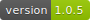
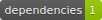
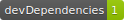

  

# setup-gh-badges

> [badges-maker](https://www.npmjs.com/package/badges-maker) made simple 

- Add this snippet to the very top of your `README.md` file:

```
      
```

ℹ️   Usage:

        $ npx setup-gh-badges


## 📌 Setup as a `GitHub Action` workflow

- create `.github/workflows/sync_badges.yml`

```
  jobs:

    sync_badges:
        runs-on: ubuntu-latest
        steps:
        - uses: actions/checkout@v4

        - uses: actions/setup-node@v4
        
        - run: |
            rm -rf .ci_badges
            npx setup-gh-badges
            git config --local user.email "action@github.com"
            git config --local user.name "GitHub Action"
            git add .ci_badges
            git commit -m "[CI:deploy] sync_badges job"

        - uses: ad-m/github-push-action@master
            with:
            github_token: ${{ secrets.GITHUB_TOKEN }}
```


## 📌 Recommended if you don't have a CI server

- `npm i husky --save-dev`

- Then add the following hook to your `package.json`:
```
    "husky": {
        "hooks": {
            "pre-push": "npx setup-gh-badges"
        }
    },
```
